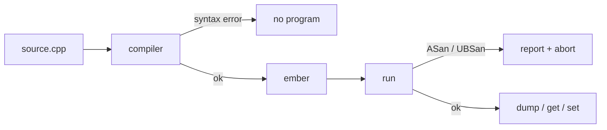

# Notes 01 — Типи, компіляція, коробка байтів

Поруч із лабою: [lab-01-a-box-of-bytes.md](lab-01-a-box-of-bytes.md). Курс: [EN](README.md) · [UK](README.uk.md).

Лаба — **що здати** (CMake, dump, peek/poke, тег). Цей файл — **з чим розібратись**: коротка теорія і досліди. Підходить і на парі, і вдома. Усе — **термінал**, не кнопка Run і не вікно Watch. **Етапи, терміни й питання на захист — у [лабі](lab-01-a-box-of-bytes.md); тут вони не повторюються.** Цей файл — фрагменти, які ви запускаєте.

Перед цим файлом, один раз за семестр: [інструменти, термінал і git](setup.notes.md), потім [C++ за годину](cpp-survival-kit.notes.md). Коли щось не збирається — [errors.notes.md](errors.notes.md), там розібрані справжні повідомлення компілятора й санітайзера.

Проєкт починається не з порожньої теки, а зі [скелета](starter/README.md): prompt і дамп уже написані, ваші — чотири мітки `TODO(lab-01)`.

Скопіюй фрагмент у `scratch.cpp` і:

```bash
c++ -std=c++17 -Wall -Wextra -Werror -fsanitize=address,undefined scratch.cpp -o scratch && ./scratch
```

Перед **кожним** дослідом скажи вголос, що очікуєш. Потім звіряй з виводом `./scratch`. Проєкт — **після §4**:

```bash
cmake -S . -B build -DCMAKE_BUILD_TYPE=Debug
cmake --build build
./build/ember
```

У prompt пишеш `dump`, `get 0`, `set 0 65`, `quit`. Доказ у README — скопійований вивід термінала.

| | Зроби зараз | Зупинись, коли |
|---|---|---|
| **§1** | `sizeof` усіх типів | числа *твоєї* машини в голові |
| **§2** | `uint8_t` wrap vs signed overflow + sanitizer | розумієш, *чому* пам’ять — unsigned |
| **§3** | `0.1 + 0.2` | `== 0.3` це `false`, і це не баг компілятора |
| **§4** | `65`, `0x41`, `'A'` | ті самі біти, різний сенс |

---

## Ідея

Комп’ютер не знає про «цілі числа». Він знає **байти**. Тип — це обіцянка, як їх читати. `int` зазвичай 4 байти, `char` — один, і той самий байт `01000001` це і 65, і літера `'A'`.

Ти пишеш текст. Компілятор перекладає. Помилка синтаксису — перекладу не було. Попередження — «законно, але підозріло»; у нас `-Werror`. Помилка виконання — програма вже біжить і робить щось недозволене: виліт за масив, неініціалізоване читання. Саме для цього sanitizers.



У `ember` це видно одразу: 4096 байтів, команда `get` друкує **чотири** способи показати ту саму клітинку.

---

## 1. `sizeof` — ширина на *цій* машині

Не вчи таблицю з підручника. Надрукуй.

### Спробуй

```cpp
#include <iostream>
#include <cstdint>
int main() {
    std::cout << sizeof(char) << ' ' << sizeof(int) << ' '
              << sizeof(float) << ' ' << sizeof(double) << ' '
              << sizeof(void*) << '\n';
    std::cout << sizeof(std::uint8_t) << ' ' << sizeof(std::uint16_t) << '\n';
}
```

**Очікуй** (типовий 64-bit): `1 4 4 8 8` і `1 2`. Якщо інакше — пиши *своє* в README. `std::uint8_t` завжди 1; саме тому клітинка VM — він, а не «просто `int`».

---

## 2. Переповнення: wrap vs UB

Unsigned 8-bit: після 255 йде 0. Це **визначено**. Signed `int` overflow — **UB**; з UBSan програма може впасти, без нього — «працювати» дивно.

### Спробуй

```cpp
#include <iostream>
#include <cstdint>
int main() {
    std::uint8_t u = 255;
    u = static_cast<std::uint8_t>(u + 1);
    std::cout << (int)u << '\n';          // 0

    int s = 2147483647;
    s = s + 1;                            // UBSan: signed overflow
    std::cout << s << '\n';
}
```

Збирай з `-fsanitize=undefined`. **Очікуй:** перший рядок `0`; другий — репорт UBSan.

**У ember:** клітинки пам’яті — `uint8_t`. ALU наступної лаби теж wrap. Signed `int` — для лічильників у C++-програмі (хост), не для байтів усередині `ember` (гість).

---

## 3. Числа з рухомою комою

Більшість десяткових дробів не мають точного бітового запису.

### Спробуй

```cpp
#include <iostream>
int main() {
    std::cout << (0.1 + 0.2) << '\n';
    std::cout << std::boolalpha << (0.1 + 0.2 == 0.3) << '\n';
}
```

**Очікуй:** щось на кшталт `0.3` на екрані (округлення друку) і `false` в порівнянні.

**Навіщо:** пікселі, адреси, лічильники — цілі. `float` лише коли величина справді приблизна.

---

## 4. Символ — це теж число

ASCII `'A'` = 65 = `0x41`.

### Спробуй

```cpp
#include <iostream>
int main() {
    std::cout << 65 << ' ' << 0x41 << ' '
              << static_cast<int>('A') << ' '
              << static_cast<char>(65) << '\n';
    std::cout << static_cast<char>('A' + 1) << '\n';
    std::cout << 5 / 2 << ' ' << 5 / 2.0 << '\n';
}
```

**Очікуй:** `65 65 65 A`, потім `B`, потім `2 2.5`. Цілочисельне ділення **відкидає** дріб.

`int x;` без ініціалізації — сміття. Завжди `int x = 0;` або `Byte data[4096]{}` — фігурні дужки **занулюють** пам’ять ember.

---

## У проєкті `ember`

| Ідея | Де дивитись |
|---|---|
| 4096 нулів | `src/memory.hpp` — `{}` на масиві |
| чотири способи показати байт | `get` |
| hex + ASCII | `dump` |
| sanitizers | `CMakeLists.txt` Debug |

**M1 зроблено**, якщо не відкриваючи код: `./build/ember` дає prompt, `dump` — сторінка нулів.

Свою роботу знайти одним рядком:

```bash
grep -rn "TODO(lab-01)" src/
```

Чотири мітки: `mem_get`, `mem_set`, ASCII-колонка в дампі, `show_byte`.

M4 (wrap, float, `"AB\0"`, прибрані `{}`) — у README, код знову чистий. Фігурні
дужки **обов'язково** повернути: читати неініціалізовану пам'ять — UB, а курс UB
не здає.

---

## Якщо мало часу

Три запуски: §1, §2, §4. Потім `set 0 65` / `get 0`. Решту — з лаби, розділ «Теорія».
